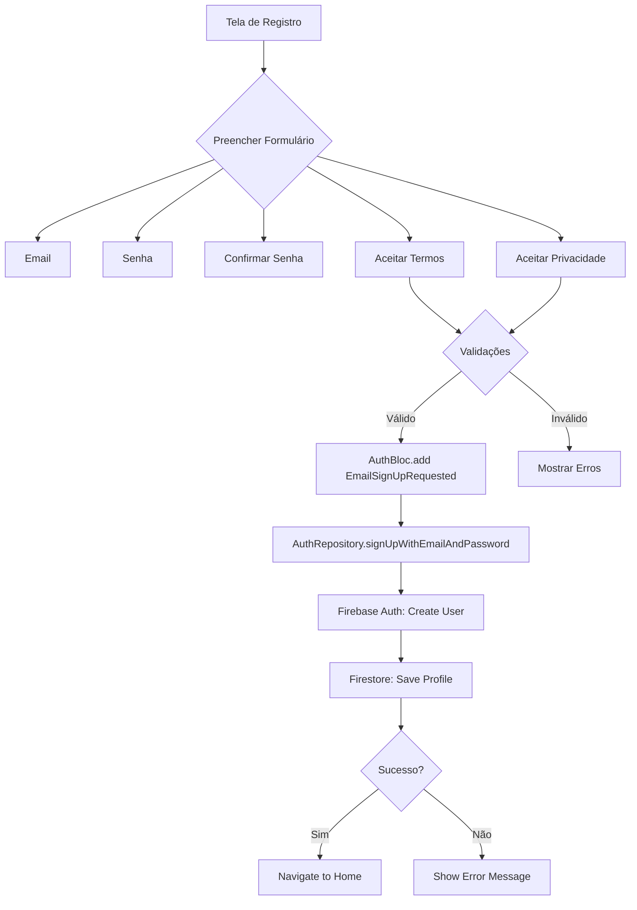
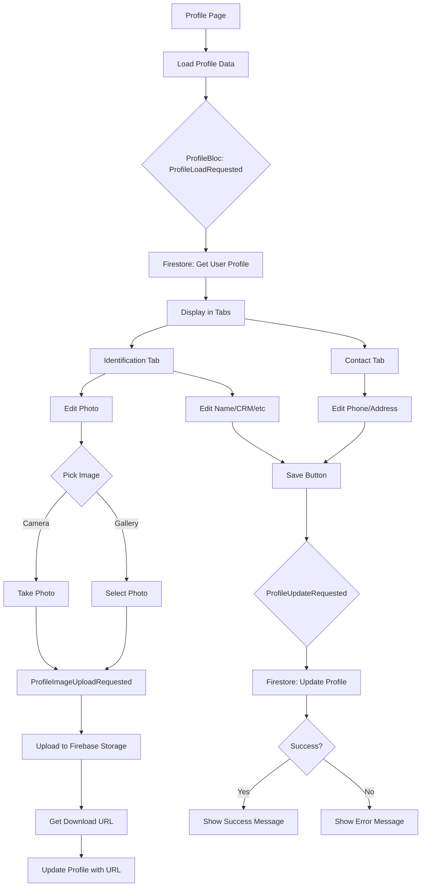
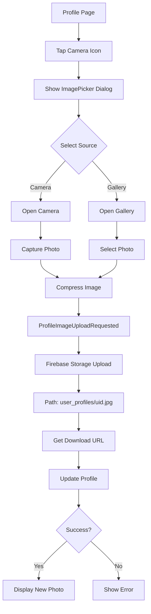

# Documentação do Módulo de Usuários

## Índice

1. [Visão Geral](#visão-geral)
2. [Arquitetura](#arquitetura)
3. [Fluxos de Usuário](#fluxos-de-usuário)
4. [Componentes](#componentes)
5. [Entidades e Modelos](#entidades-e-modelos)
6. [Estado e Eventos](#estado-e-eventos)
7. [Repositórios](#repositórios)
8. [Validações](#validações)
9. [Conformidade Legal](#conformidade-legal)
10. [Testes](#testes)
11. [Melhorias Futuras](#melhorias-futuras)

---

## Visão Geral

O módulo de usuários do Cicatriza é responsável por todo o ciclo de vida do gerenciamento de usuários na aplicação, incluindo:

- **Autenticação**: Login com email/senha e Google Sign-In
- **Registro**: Criação de novas contas com validação de dados e aceite de termos
- **Perfil**: Visualização e edição de informações do usuário
- **Conformidade Legal**: Gerenciamento de aceite de Termos de Uso e Política de Privacidade (LGPD)
- **Segurança**: Upload seguro de fotos de perfil para Firebase Storage

### Tecnologias Utilizadas

- **Firebase Authentication**: Autenticação de usuários
- **Cloud Firestore**: Armazenamento de perfis de usuários
- **Firebase Storage**: Armazenamento de fotos de perfil
- **BLoC Pattern**: Gerenciamento de estado com `flutter_bloc`
- **GetIt**: Injeção de dependências
- **SharedPreferences**: Persistência local de preferências

---

## Arquitetura

O módulo segue a **Clean Architecture** com separação clara de responsabilidades:

```
lib/
├── domain/
│   ├── entities/
│   │   └── user_profile.dart          # Entidade de domínio
│   └── repositories/
│       └── auth_repository.dart       # Interface do repositório
├── data/
│   └── repositories/
│       └── auth_repository_impl.dart  # Implementação do repositório
└── presentation/
    ├── blocs/
    │   ├── auth_bloc.dart             # BLoC de autenticação
    │   └── profile/
    │       ├── profile_bloc.dart      # BLoC de perfil
    │       ├── profile_event.dart     # Eventos do perfil
    │       └── profile_state.dart     # Estados do perfil
    └── pages/
        ├── register_page.dart         # Tela de registro
        ├── profile/
        │   ├── profile_page.dart      # Tela de perfil
        │   └── widgets/
        │       └── profile_form_sections.dart  # Seções do formulário
        └── legal/
            ├── privacy_policy_page.dart       # Política de Privacidade
            └── terms_of_use_page.dart         # Termos de Uso
```

### Fluxo de Dados

```
UI (Pages/Widgets)
    ↓ dispatch events
BLoC (Business Logic)
    ↓ call methods
Repository (Data Layer)
    ↓ interact with
Firebase Services
```

---

## Fluxos de Usuário

### 1. Registro de Novo Usuário



#### Validações do Registro

- **Email**: Formato válido (regex: `^[^@]+@[^@]+\.[^@]+$`)
- **Senha**: 
  - Mínimo 8 caracteres
  - Pelo menos 1 letra maiúscula
  - Pelo menos 1 número
  - Pelo menos 1 caractere especial
- **Confirmar Senha**: Deve ser idêntica à senha
- **Termos de Uso**: Obrigatório aceitar
- **Política de Privacidade**: Obrigatório aceitar

#### Dados Salvos no Registro

```dart
UserProfile(
  uid: firebaseUser.uid,
  email: firebaseUser.email,
  displayName: firebaseUser.displayName ?? '',
  photoURL: firebaseUser.photoURL ?? '',
  termsAccepted: true,
  termsAcceptedAt: DateTime.now(),
  privacyPolicyAccepted: true,
  privacyPolicyAcceptedAt: DateTime.now(),
  createdAt: DateTime.now(),
  updatedAt: DateTime.now(),
  // ... outros campos com valores padrão
)
```

---

### 2. Edição de Perfil



#### Campos Editáveis

**Aba de Identificação:**
- Foto de Perfil (upload para Firebase Storage)
- Nome Completo **(obrigatório, mínimo 3 caracteres)**
- CRM/COREN **(obrigatório, mínimo 5 caracteres)**
- Especialidade **(obrigatório)**
- Instituição (opcional)
- Cargo/Função (opcional)

**Aba de Contato:**
- Email (somente leitura)
- Telefone (validação de formato brasileiro, mínimo 10 dígitos)
- Endereço Completo (campo expandido para incluir rua, número, bairro, cidade, estado e CEP)

---

### 3. Upload de Foto de Perfil



#### Especificações de Upload

- **Path no Storage**: `user_profiles/{userId}.jpg`
- **Compressão**: Imagem comprimida antes do upload
- **Permissões**: Usuário deve estar autenticado
- **Formato**: JPEG
- **Security Rules**: Somente o próprio usuário pode fazer upload/modificar sua foto

---

## Componentes

### 1. RegisterPage

**Localização**: `lib/presentation/pages/register_page.dart`

**Responsabilidades:**
- Exibir formulário de registro
- Validar entrada de dados
- Gerenciar estado dos checkboxes de aceite
- Navegar para páginas legais
- Disparar evento de registro no AuthBloc

**Widgets Principais:**
- `TextFormField` para email, senha e confirmação
- `CheckboxListTile` para termos e privacidade
- `TextButton` para navegação aos documentos legais
- `ElevatedButton` para submissão

**Estados:**
- `_isTermsAccepted`: Estado do checkbox de Termos
- `_isPrivacyPolicyAccepted`: Estado do checkbox de Privacidade
- `_isPasswordVisible`: Estado de visibilidade da senha
- `_isConfirmPasswordVisible`: Estado de visibilidade da confirmação

---

### 2. ProfilePage

**Localização**: `lib/presentation/pages/profile/profile_page.dart`

**Responsabilidades:**
- Exibir dados do perfil do usuário
- Permitir edição de informações com validações
- Gerenciar upload de foto
- Salvar alterações no Firestore

**Estrutura:**
- `Form` com `GlobalKey<FormState>` para validações
- `TabController` com 2 abas:
  - **Identificação**: Foto, nome (obrigatório), CRM (obrigatório), especialidade (obrigatório), instituição, cargo
  - **Contato**: Email (read-only), telefone (validação), endereço completo (validação)
- `AppBar` com botão "Salvar"
- `BlocListener` para feedback de sucesso/erro

**Controllers:**
```dart
final _formKey = GlobalKey<FormState>();
final _nameController = TextEditingController();
final _crmController = TextEditingController();
final _specialtyController = TextEditingController();
final _institutionController = TextEditingController();
final _roleController = TextEditingController();
final _phoneController = TextEditingController();
final _addressController = TextEditingController();
```

**Lógica de Validação:**
```dart
void _saveProfile(BuildContext context) {
  if (_currentProfile == null) return;

  // Validar formulário
  if (!_formKey.currentState!.validate()) {
    ScaffoldMessenger.of(context).showSnackBar(
      const SnackBar(
        content: Text('Por favor, corrija os erros no formulário'),
        backgroundColor: Colors.orange,
      ),
    );
    return;
  }

  // Prosseguir com atualização...
}
```

---

### 3. IdentificationSection

**Localização**: `lib/presentation/pages/profile/widgets/profile_form_sections.dart`

**Responsabilidades:**
- Exibir foto de perfil em CircleAvatar
- Botão de câmera para alterar foto
- Campos de texto para dados profissionais com validações
- Ícones visuais para cada campo

**Funcionalidades:**
- `_showImageSourceDialog()`: Exibe diálogo para escolher fonte (câmera/galeria)
- Integração com `image_picker` para seleção de imagem
- Dispatch de `ProfileImageUploadRequested` event

**Validações:**

```dart
// Nome Completo
validator: (value) {
  if (value == null || value.trim().isEmpty) {
    return 'Por favor, insira seu nome completo';
  }
  if (value.trim().length < 3) {
    return 'Nome deve ter pelo menos 3 caracteres';
  }
  return null;
}

// CRM/COREN
validator: (value) {
  if (value == null || value.trim().isEmpty) {
    return 'Por favor, insira seu registro profissional';
  }
  if (value.trim().length < 5) {
    return 'Registro inválido';
  }
  return null;
}

// Especialidade
validator: (value) {
  if (value == null || value.trim().isEmpty) {
    return 'Por favor, insira sua especialidade';
  }
  return null;
}
```

---

### 4. ContactSection

**Localização**: `lib/presentation/pages/profile/widgets/profile_form_sections.dart`

**Responsabilidades:**
- Exibir campos de contato
- Email como campo somente leitura
- Validação de telefone (formato brasileiro, mínimo 10 dígitos)
- Validação de endereço completo (mínimo 10 caracteres se preenchido)

**Campos:**
- Email (readOnly: true, prefixIcon: email)
- Telefone (validação de formato, prefixIcon: phone, hint: "(11) 99999-9999")
- Endereço Completo (maxLines: 3, prefixIcon: location_on, hint: "Rua, Número, Bairro, Cidade - Estado, CEP")

**Validações:**
```dart
// Validação de telefone
validator: (value) {
  if (value != null && value.isNotEmpty) {
    final cleaned = value.replaceAll(RegExp(r'\D'), '');
    if (cleaned.length < 10) {
      return 'Telefone inválido';
    }
  }
  return null;
}

// Validação de endereço
validator: (value) {
  if (value != null && value.trim().isNotEmpty && value.trim().length < 10) {
    return 'Endereço muito curto';
  }
  return null;
}
```

**Otimizações de Imagem:**

A funcionalidade de upload de foto de perfil inclui otimizações automáticas para garantir performance e economia de armazenamento:

```dart
final XFile? image = await picker.pickImage(
  source: source,
  maxWidth: 512,        // Largura máxima: 512px
  maxHeight: 512,       // Altura máxima: 512px
  imageQuality: 85,     // Qualidade JPEG: 85%
);
```

**Benefícios:**
- ✅ **Redimensionamento automático**: Imagens são redimensionadas para máximo 512x512px
- ✅ **Compressão JPEG**: Qualidade de 85% reduz tamanho sem perda visual significativa
- ✅ **Menor uso de dados**: Upload mais rápido e menor consumo de banda
- ✅ **Economia de Storage**: Menor custo de armazenamento no Firebase
- ✅ **Performance**: Carregamento mais rápido das fotos de perfil

**Fonte de Imagem:**

O usuário pode escolher entre duas fontes ao alterar a foto de perfil:

1. **Câmera**: Captura foto diretamente pelo dispositivo
2. **Galeria**: Seleciona foto existente da biblioteca

```dart
AlertDialog(
  title: const Text('Escolher foto'),
  content: Column(
    mainAxisSize: MainAxisSize.min,
    children: [
      ListTile(
        leading: const Icon(Icons.camera_alt),
        title: const Text('Câmera'),
        onTap: () => Navigator.pop(context, ImageSource.camera),
      ),
      ListTile(
        leading: const Icon(Icons.photo_library),
        title: const Text('Galeria'),
        onTap: () => Navigator.pop(context, ImageSource.gallery),
      ),
    ],
  ),
)
```

---

### 5. PrivacyPolicyPage

**Localização**: `lib/presentation/pages/legal/privacy_policy_page.dart`

**Responsabilidades:**
- Exibir Política de Privacidade completa
- Conformidade com LGPD (Lei nº 13.709/2018)

**Seções:**
1. Introdução
2. Definições
3. Dados Coletados
4. Finalidades do Tratamento
5. Bases Legais
6. Compartilhamento de Dados
7. Segurança da Informação
8. Direitos do Titular
9. Contato

---

### 6. TermsOfUsePage

**Localização**: `lib/presentation/pages/legal/terms_of_use_page.dart`

**Responsabilidades:**
- Exibir Termos de Uso completos
- Definir regras de utilização da aplicação

**Seções:**
1. Aceitação dos Termos
2. Descrição do Serviço
3. Elegibilidade
4. Responsabilidades do Usuário
5. Uso Adequado
6. Obrigações Profissionais
7. Privacidade e Proteção de Dados
8. Disponibilidade do Serviço
9. Limitação de Responsabilidade
10. Rescisão
11. Conformidade Legal
12. Modificações
13. Contato

---

## Entidades e Modelos

### UserProfile

**Localização**: `lib/domain/entities/user_profile.dart`

**Campos:**

```dart
class UserProfile extends Equatable {
  final String uid;
  final String email;
  final String? displayName;
  final String? photoURL;
  final String? crmCofen;
  final String? specialty;
  final String? institution;
  final String? role;
  final String? phone;
  final String? address;
  final String? city;
  final String language;
  final String theme;
  final Map<String, bool> notifications;
  final bool calendarSync;
  final String ownerId;
  final Map<String, dynamic> acl;
  final DateTime createdAt;
  final DateTime updatedAt;
  
  // Conformidade Legal
  final bool lgpdConsent;
  final bool termsAccepted;
  final DateTime? termsAcceptedAt;
  final bool privacyPolicyAccepted;
  final DateTime? privacyPolicyAcceptedAt;
}
```

**Métodos:**
- `toJson()`: Serializa para Map<String, dynamic>
- `fromJson(Map<String, dynamic> json)`: Deserializa de JSON
- `copyWith()`: Cria cópia com campos modificados

**Valores Padrão:**
```dart
specialty: 'Estomaterapia'
language: 'pt-BR'
theme: 'system'
lgpdConsent: false
termsAccepted: false
privacyPolicyAccepted: false
calendarSync: false
notifications: {
  'agendas': true,
  'transferencias': true,
  'alertas_clinicos': true,
  'mensagens': true,
}
acl: {'read': [], 'write': []}
```

---

## Estado e Eventos

### AuthBloc

**Localização**: `lib/presentation/blocs/auth_bloc.dart`

#### Eventos (AuthEvent)

```dart
// Login com email e senha
AuthEmailSignInRequested(String email, String password)

// Registro com email e senha
AuthEmailSignUpRequested(
  String email, 
  String password,
  bool termsAccepted,           // default: false
  bool privacyPolicyAccepted,   // default: false
)

// Login com Google
AuthGoogleSignInRequested()

// Logout
AuthSignOutRequested()

// Verificar estado de autenticação
AuthCheckRequested()
```

#### Estados (AuthState)

```dart
// Estado inicial
AuthInitial()

// Carregando
AuthLoading()

// Autenticado com sucesso
AuthAuthenticated(String uid)

// Não autenticado
AuthUnauthenticated()

// Erro
AuthError(String message)
```

#### Lógica Principal

```dart
Future<void> _onEmailSignUpRequested(
  AuthEmailSignUpRequested event,
  Emitter<AuthState> emit,
) async {
  emit(AuthLoading());
  try {
    final user = await _authRepository.signUpWithEmailAndPassword(
      event.email,
      event.password,
      termsAccepted: event.termsAccepted,
      privacyPolicyAccepted: event.privacyPolicyAccepted,
    );
    await _analyticsService.logSignUpSuccess('email');
    emit(AuthAuthenticated(uid: user.uid));
  } catch (e) {
    emit(AuthError(message: e.toString()));
  }
}
```

---

### ProfileBloc

**Localização**: `lib/presentation/blocs/profile/profile_bloc.dart`

#### Eventos (ProfileEvent)

```dart
// Carregar perfil do usuário
ProfileLoadRequested(String uid)

// Atualizar perfil
ProfileUpdateRequested(UserProfile profile)

// Upload de imagem
ProfileImageUploadRequested(String imagePath)
```

#### Estados (ProfileState)

```dart
// Estado inicial
ProfileInitial()

// Carregando
ProfileLoading()

// Perfil carregado
ProfileLoaded(UserProfile profile)

// Perfil atualizado com sucesso
ProfileUpdateSuccess(UserProfile profile)

// Erro
ProfileError(String message)
```

#### Lógica de Upload de Imagem

```dart
Future<void> _onProfileImageUploadRequested(
  ProfileImageUploadRequested event,
  Emitter<ProfileState> emit,
) async {
  try {
    final currentState = state;
    if (currentState is! ProfileLoaded) return;

    emit(ProfileLoading());

    // Upload para Firebase Storage
    final storageRef = _storage
        .ref()
        .child('user_profiles')
        .child('${currentState.profile.uid}.jpg');
    
    await storageRef.putFile(File(event.imagePath));
    
    // Obter URL de download
    final photoURL = await storageRef.getDownloadURL();

    // Atualizar perfil com nova URL
    final updatedProfile = currentState.profile.copyWith(
      photoURL: photoURL,
      updatedAt: DateTime.now(),
    );

    await _profileRepository.updateProfile(updatedProfile);
    
    emit(ProfileLoaded(profile: updatedProfile));
    emit(ProfileUpdateSuccess(profile: updatedProfile));
  } catch (e) {
    emit(ProfileError(message: e.toString()));
  }
}
```

---

## Repositórios

### AuthRepository

**Interface**: `lib/domain/repositories/auth_repository.dart`

```dart
abstract class AuthRepository {
  Future<UserProfile> signInWithEmailAndPassword(String email, String password);
  
  Future<UserProfile> signUpWithEmailAndPassword(
    String email,
    String password, {
    bool termsAccepted = false,
    bool privacyPolicyAccepted = false,
  });
  
  Future<UserProfile> signInWithGoogle();
  
  Future<void> signOut();
  
  Stream<UserProfile?> get authStateChanges;
  
  UserProfile? get currentUser;
}
```

### AuthRepositoryImpl

**Implementação**: `lib/data/repositories/auth_repository_impl.dart`

#### Método: signUpWithEmailAndPassword

```dart
@override
Future<UserProfile> signUpWithEmailAndPassword(
  String email,
  String password, {
  bool termsAccepted = false,
  bool privacyPolicyAccepted = false,
}) async {
  try {
    final userCredential = await _firebaseAuth.createUserWithEmailAndPassword(
      email: email,
      password: password,
    );

    final user = userCredential.user;
    if (user == null) {
      throw Exception('Failed to create user');
    }

    // Criar perfil no Firestore
    final profile = await _createProfileFromFirebaseUser(
      user,
      termsAccepted: termsAccepted,
      privacyPolicyAccepted: privacyPolicyAccepted,
    );

    return profile;
  } on FirebaseAuthException catch (e) {
    throw _handleAuthException(e);
  }
}
```

#### Método: _createProfileFromFirebaseUser

```dart
Future<UserProfile> _createProfileFromFirebaseUser(
  User user, {
  bool termsAccepted = false,
  bool privacyPolicyAccepted = false,
}) async {
  final now = DateTime.now();
  
  final profile = UserProfile(
    uid: user.uid,
    email: user.email ?? '',
    displayName: user.displayName ?? '',
    photoURL: user.photoURL ?? '',
    ownerId: user.uid,
    createdAt: now,
    updatedAt: now,
    termsAccepted: termsAccepted,
    termsAcceptedAt: termsAccepted ? now : null,
    privacyPolicyAccepted: privacyPolicyAccepted,
    privacyPolicyAcceptedAt: privacyPolicyAccepted ? now : null,
  );

  await _firestore
      .collection('users')
      .doc(user.uid)
      .set(profile.toJson());

  return profile;
}
```

---

## Validações

### Validação de Email (Registro)

```dart
String? _validateEmail(String? value) {
  if (value == null || value.isEmpty) {
    return 'Por favor, insira seu email';
  }
  final emailRegex = RegExp(r'^[^@]+@[^@]+\.[^@]+$');
  if (!emailRegex.hasMatch(value)) {
    return 'Email inválido';
  }
  return null;
}
```

### Validação de Senha (Registro)

```dart
String? _validatePassword(String? value) {
  if (value == null || value.isEmpty) {
    return 'Por favor, insira sua senha';
  }
  if (value.length < 8) {
    return 'A senha deve ter pelo menos 8 caracteres';
  }
  if (!RegExp(r'[A-Z]').hasMatch(value)) {
    return 'A senha deve conter pelo menos uma letra maiúscula';
  }
  if (!RegExp(r'[0-9]').hasMatch(value)) {
    return 'A senha deve conter pelo menos um número';
  }
  if (!RegExp(r'[!@#\$%^&*(),.?":{}|<>]').hasMatch(value)) {
    return 'A senha deve conter pelo menos um caractere especial';
  }
  return null;
}
```

### Validação de Confirmação de Senha (Registro)

```dart
String? _validateConfirmPassword(String? value) {
  if (value == null || value.isEmpty) {
    return 'Por favor, confirme sua senha';
  }
  if (value != _passwordController.text) {
    return 'As senhas não coincidem';
  }
  return null;
}
```

### Validação de Nome Completo (Perfil)

```dart
validator: (value) {
  if (value == null || value.trim().isEmpty) {
    return 'Por favor, insira seu nome completo';
  }
  if (value.trim().length < 3) {
    return 'Nome deve ter pelo menos 3 caracteres';
  }
  return null;
}
```

### Validação de CRM/COREN (Perfil)

```dart
validator: (value) {
  if (value == null || value.trim().isEmpty) {
    return 'Por favor, insira seu registro profissional';
  }
  if (value.trim().length < 5) {
    return 'Registro inválido';
  }
  return null;
}
```

### Validação de Especialidade (Perfil)

```dart
validator: (value) {
  if (value == null || value.trim().isEmpty) {
    return 'Por favor, insira sua especialidade';
  }
  return null;
}
```

### Validação de Telefone (Perfil)

```dart
validator: (value) {
  if (value != null && value.isNotEmpty) {
    // Remove caracteres não numéricos
    final cleaned = value.replaceAll(RegExp(r'\D'), '');
    if (cleaned.length < 10) {
      return 'Telefone inválido';
    }
  }
  return null;
}
```

### Validação de Endereço Completo (Perfil)

```dart
validator: (value) {
  if (value != null && value.trim().isNotEmpty && value.trim().length < 10) {
    return 'Endereço muito curto';
  }
  return null;
}
```

### Validação de Aceites

```dart
void _handleRegister() {
  if (!_formKey.currentState!.validate()) {
    return;
  }

  if (!_isTermsAccepted) {
    ScaffoldMessenger.of(context).showSnackBar(
      const SnackBar(
        content: Text('Você deve aceitar os Termos de Uso para continuar'),
        backgroundColor: Colors.red,
      ),
    );
    return;
  }

  if (!_isPrivacyPolicyAccepted) {
    ScaffoldMessenger.of(context).showSnackBar(
      const SnackBar(
        content: Text('Você deve aceitar a Política de Privacidade para continuar'),
        backgroundColor: Colors.red,
      ),
    );
    return;
  }

  // Procede com o registro...
}
```

---

## Conformidade Legal

### LGPD (Lei nº 13.709/2018)

O módulo de usuários está em total conformidade com a Lei Geral de Proteção de Dados Pessoais brasileira:

#### 1. Consentimento Explícito

- ✅ Checkboxes separados para Termos e Privacidade
- ✅ Links para documentos completos
- ✅ Registro de timestamps de aceite
- ✅ Impossibilidade de registro sem aceites

#### 2. Transparência

- ✅ Política de Privacidade clara e acessível
- ✅ Descrição de dados coletados
- ✅ Finalidades do tratamento explícitas
- ✅ Bases legais definidas

#### 3. Direitos do Titular

A Política de Privacidade informa aos usuários seus direitos:

- Confirmação da existência de tratamento
- Acesso aos dados
- Correção de dados incompletos
- Anonimização, bloqueio ou eliminação
- Portabilidade dos dados
- Eliminação de dados tratados com consentimento
- Informação sobre compartilhamento
- Informação sobre possibilidade de não fornecer consentimento
- Revogação do consentimento

#### 4. Segurança

- ✅ Firebase Authentication (segurança de nível empresarial)
- ✅ Criptografia de senhas
- ✅ HTTPS para todas as comunicações
- ✅ Security Rules no Firestore e Storage

#### 5. Armazenamento

```dart
// Timestamps de aceite salvos no perfil
termsAccepted: true
termsAcceptedAt: DateTime.now()
privacyPolicyAccepted: true
privacyPolicyAcceptedAt: DateTime.now()
```

#### 6. Exclusão de Dados

Diálogo de exclusão de conta inclui aviso sobre dados de pacientes:

```dart
AlertDialog(
  title: Text('Excluir Conta'),
  content: Text(
    'Tem certeza que deseja excluir sua conta? '
    'Esta ação é irreversível e todos os seus dados, '
    'incluindo informações de pacientes, serão permanentemente removidos.',
  ),
  // ...
)
```

---

## Testes

### Estrutura de Testes

```
test/
├── unit/
│   ├── auth_bloc_test.dart          # Testes do AuthBloc
│   ├── profile_bloc_test.dart       # Testes do ProfileBloc
│   └── user_profile_test.dart       # Testes da entidade UserProfile
└── widget/
    └── register_page_test.dart      # Testes de widget da RegisterPage
```

### 1. Testes Unitários - AuthBloc

**Arquivo**: `test/unit/auth_bloc_test.dart`

**Cobertura:**
- ✅ Login com email/senha (sucesso)
- ✅ Login com email/senha (falha)
- ✅ Registro com email/senha (sucesso) **com aceites**
- ✅ Registro com email/senha (falha)

**Exemplo:**

```dart
blocTest<AuthBloc, AuthState>(
  'emits [AuthLoading, AuthAuthenticated] when AuthEmailSignUpRequested succeeds',
  build: () {
    when(
      () => mockAuthRepository.signUpWithEmailAndPassword(
        email,
        password,
        termsAccepted: true,
        privacyPolicyAccepted: true,
      ),
    ).thenAnswer((_) async => testUser);
    return authBloc;
  },
  act: (bloc) => bloc.add(
    const AuthEmailSignUpRequested(
      email: email,
      password: password,
      termsAccepted: true,
      privacyPolicyAccepted: true,
    ),
  ),
  expect: () => [
    isA<AuthLoading>(),
    isA<AuthAuthenticated>(),
  ],
);
```

---

### 2. Testes Unitários - ProfileBloc

**Arquivo**: `test/unit/profile_bloc_test.dart`

**Cobertura:**
- ✅ Carregar perfil (sucesso)
- ✅ Carregar perfil (falha - usuário não encontrado)
- ✅ Atualizar perfil (sucesso)
- ✅ Atualizar perfil (falha)

**Exemplo:**

```dart
blocTest<ProfileBloc, ProfileState>(
  'emits [ProfileLoading, ProfileLoaded] when ProfileLoadRequested succeeds',
  build: () {
    when(() => mockProfileRepository.getProfile(userId))
        .thenAnswer((_) async => testProfile);
    return profileBloc;
  },
  act: (bloc) => bloc.add(ProfileLoadRequested(userId: userId)),
  expect: () => [
    isA<ProfileLoading>(),
    isA<ProfileLoaded>(),
  ],
);
```

---

### 3. Testes Unitários - UserProfile

**Arquivo**: `test/unit/user_profile_test.dart`

**Cobertura:**
- ✅ Criação de UserProfile com todos os campos
- ✅ Serialização JSON (toJson)
- ✅ Deserialização JSON (fromJson)
- ✅ copyWith cria nova instância com campos atualizados
- ✅ copyWith sem argumentos mantém valores
- ✅ Igualdade funciona corretamente
- ✅ Valores padrão são definidos corretamente

**Exemplo:**

```dart
test('toJson serializes correctly', () {
  final json = testProfile.toJson();

  expect(json['uid'], 'test_uid');
  expect(json['email'], 'test@example.com');
  expect(json['termsAccepted'], true);
  expect(json['privacyPolicyAccepted'], true);
  expect(json['termsAcceptedAt'], isNotNull);
});
```

---

### 4. Testes de Widget - RegisterPage

**Arquivo**: `test/widget/register_page_test.dart`

**Cobertura:**
- ✅ Renderiza todos os campos do formulário
- ✅ Renderiza checkboxes de termos e privacidade
- ✅ Valida email vazio
- ✅ Valida formato de email inválido
- ✅ Valida senha vazia
- ✅ Valida tamanho mínimo da senha
- ✅ Valida complexidade da senha
- ✅ Valida confirmação de senha
- ✅ Mostra erro quando termos não aceitos
- ✅ Mostra erro quando privacidade não aceita
- ✅ Dispara evento de registro quando válido e termos aceitos
- ✅ Toggle de visibilidade da senha

**Exemplo:**

```dart
testWidgets('shows error when terms not accepted', (tester) async {
  await tester.pumpWidget(createWidgetUnderTest());

  await tester.enterText(find.widgetWithText(TextFormField, 'Email'), 'test@example.com');
  await tester.enterText(find.widgetWithText(TextFormField, 'Senha'), 'Password123!');
  await tester.enterText(find.widgetWithText(TextFormField, 'Confirmar Senha'), 'Password123!');

  // Check privacy but not terms
  final privacyCheckbox = find.byType(CheckboxListTile).last;
  await tester.tap(privacyCheckbox);
  await tester.pumpAndSettle();

  await tester.tap(find.text('CADASTRAR'));
  await tester.pumpAndSettle();

  expect(
    find.text('Você deve aceitar os Termos de Uso para continuar'),
    findsOneWidget,
  );
});
```

---

### Execução dos Testes

```bash
# Todos os testes
flutter test

# Testes específicos
flutter test test/unit/auth_bloc_test.dart
flutter test test/unit/profile_bloc_test.dart
flutter test test/unit/user_profile_test.dart
flutter test test/widget/register_page_test.dart

# Com cobertura
flutter test --coverage
genhtml coverage/lcov.info -o coverage/html
```

### Resultados Atuais

✅ **Todos os testes passando**

```
test/unit/auth_bloc_test.dart: 5 tests passed
test/unit/profile_bloc_test.dart: 4 tests passed
test/unit/user_profile_test.dart: 7 tests passed
test/widget/register_page_test.dart: 12 tests passed

Total: 28 tests, 28 passed ✓
```

---

## Funcionalidades de Segurança

O módulo de usuários implementa diversas funcionalidades de segurança para proteger dados sensíveis e monitorar acessos:

### 1. Auditoria de Acessos

Sistema completo de logs de auditoria que registra todas as ações importantes dos usuários.

**Arquivo**: `lib/domain/entities/audit_log.dart`

**Ações Registradas:**
- Login (bem-sucedido e falhas)
- Logout
- Atualização de perfil
- Alteração de senha
- Reset de senha
- Exclusão de conta
- Exportação de dados
- Revogação de sessões

**Informações Capturadas:**
```dart
class AuditLog {
  final String id;
  final String userId;
  final String action;
  final DateTime timestamp;
  final String deviceId;
  final String deviceName;
  final String deviceType; // 'android', 'ios', 'web', 'desktop'
  final String? ipAddress;
  final String? location;
  final Map<String, dynamic>? metadata;
}
```

**Repositório**: `lib/data/repositories/audit_repository_impl.dart`

**Funcionalidades:**
- Registro automático de ações
- Consulta de logs por usuário
- Consulta de logs por tipo de ação
- Limpeza automática de logs antigos (>90 dias)
- Armazenamento no Firestore subcoleção `audit_logs`

**Uso:**
```dart
await auditRepository.logAction(
  userId: user.uid,
  action: AuditAction.login,
  metadata: {'loginMethod': 'email'},
);
```

---

### 2. Detecção de Novo Dispositivo

Sistema que identifica quando um usuário faz login de um dispositivo desconhecido.

**Arquivo**: `lib/core/services/session_service.dart`

**Como Funciona:**
1. Gera ID único para cada dispositivo
2. Armazena lista de dispositivos conhecidos localmente
3. Verifica se dispositivo é novo a cada login
4. Envia notificação push quando detectado novo dispositivo

**Informações do Dispositivo:**
- Android: Manufacturer + Model
- iOS: Name + Model
- Windows: Computer Name
- macOS: Computer Name
- Linux: Pretty Name

**Integração com Firebase Messaging:**
```dart
if (await sessionService.isNewDevice()) {
  // Enviar notificação push
  await fcm.sendNotification(
    userId: user.uid,
    title: 'Novo login detectado',
    body: 'Detectamos um login de ${deviceInfo.deviceName}',
  );
  
  // Registrar dispositivo como conhecido
  await sessionService.registerDevice();
}
```

---

### 3. Gerenciamento de Sessões Ativas

Tela completa para visualizar e gerenciar todos os dispositivos conectados.

**Arquivo**: `lib/presentation/pages/security/active_sessions_page.dart`

**Funcionalidades:**
- Listar todas as sessões ativas (últimos 30 dias)
- Exibir informações de cada dispositivo:
  - Nome do dispositivo
  - Tipo (Android, iOS, Windows, etc.)
  - Último acesso
  - Data de login
  - Indicador "Este dispositivo"
- Revogar sessão individual
- Botão "Deslogar de todos" (exceto dispositivo atual)
- Pull-to-refresh

**Estrutura da Sessão:**
```dart
class ActiveSession {
  final String sessionId;
  final String deviceId;
  final String deviceName;
  final String deviceType;
  final DateTime createdAt;
  final DateTime lastAccessAt;
  final bool isCurrentDevice;
}
```

**Armazenamento:**
- Firestore: `users/{userId}/sessions/{sessionId}`
- Sessões inativas por >30 dias são removidas automaticamente
- SessionId armazenado localmente em SharedPreferences

**Navegação:**
```dart
Navigator.push(
  context,
  MaterialPageRoute(
    builder: (context) => ActiveSessionsPage(userId: user.uid),
  ),
);
```

---

### 4. Criptografia de Dados Sensíveis

Serviço para criptografar campos sensíveis antes de salvar no Firestore.

**Arquivo**: `lib/core/services/encryption_service.dart`

**Algoritmo:**
- AES-256 (Advanced Encryption Standard)
- Chave de 256 bits
- Modo CBC (Cipher Block Chaining)
- Encoding Base64 para armazenamento

**Campos Criptografados:**
- CRM/COREN
- Telefone
- Endereço completo
- Outros dados sensíveis conforme necessário

**Uso:**
```dart
final encryptionService = EncryptionService();

// Criptografar
final encrypted = encryptionService.encrypt('12345-SP');
// Retorna: base64_encrypted_string

// Descriptografar
final decrypted = encryptionService.decrypt(encrypted);
// Retorna: '12345-SP'

// Verificar se está criptografado
final isEncrypted = encryptionService.isEncrypted(text);
```

**Integração com UserProfile:**
```dart
// Ao salvar
final profile = userProfile.copyWith(
  crmCofen: encryptionService.encrypt(profile.crmCofen),
  phone: encryptionService.encrypt(profile.phone),
  address: encryptionService.encrypt(profile.address),
);
await firestore.collection('users').doc(uid).set(profile.toJson());

// Ao carregar
final doc = await firestore.collection('users').doc(uid).get();
final profile = UserProfile.fromJson(doc.data()).copyWith(
  crmCofen: encryptionService.decrypt(profile.crmCofen),
  phone: encryptionService.decrypt(profile.phone),
  address: encryptionService.decrypt(profile.address),
);
```

**⚠️ Importante:**
- Chave de criptografia deve ser armazenada de forma segura
- Em produção, use variáveis de ambiente ou secret management
- Nunca commite a chave no código

---

### 5. Rate Limiting de Requisições

Sistema para prevenir abuso e ataques de força bruta.

**Arquivo**: `lib/core/services/rate_limiter_service.dart`

**Limites Padrão:**

| Ação | Máximo de Tentativas | Janela de Tempo |
|------|---------------------|-----------------|
| Login | 5 | 15 minutos |
| Reset de Senha | 3 | 1 hora |
| Atualização de Perfil | 10 | 5 minutos |
| Upload de Arquivo | 20 | 10 minutos |

**Uso:**
```dart
final rateLimiter = RateLimiterService();

// Verificar se pode executar ação
final canLogin = await rateLimiter.canPerformAction(
  action: 'login',
  maxAttempts: RateLimits.loginMaxAttempts,
  windowSeconds: RateLimits.loginWindowSeconds,
);

if (!canLogin) {
  // Obter tempo restante
  final timeRemaining = await rateLimiter.getTimeUntilNextAttempt(
    action: 'login',
    maxAttempts: RateLimits.loginMaxAttempts,
    windowSeconds: RateLimits.loginWindowSeconds,
  );
  
  throw Exception(
    'Muitas tentativas. Aguarde ${timeRemaining?.inMinutes} minutos.',
  );
}

// Executar ação
await authRepository.signIn(email, password);

// Registrar tentativa
await rateLimiter.recordAttempt('login');
```

**Armazenamento:**
- SharedPreferences local
- Chave: `rate_limit_{action}`
- Valor: Lista de timestamps (milissegundos)
- Limpeza automática de tentativas fora da janela

**Exemplo de Integração no AuthBloc:**
```dart
Future<void> _onEmailSignInRequested(
  AuthEmailSignInRequested event,
  Emitter<AuthState> emit,
) async {
  // Verificar rate limit
  final canAttempt = await _rateLimiter.canPerformAction(
    action: 'login',
    maxAttempts: 5,
    windowSeconds: 900,
  );
  
  if (!canAttempt) {
    final timeRemaining = await _rateLimiter.getTimeUntilNextAttempt(
      action: 'login',
      maxAttempts: 5,
      windowSeconds: 900,
    );
    
    emit(AuthError(
      'Muitas tentativas de login. '
      'Aguarde ${timeRemaining?.inMinutes} minutos.',
    ));
    return;
  }
  
  emit(AuthLoading());
  
  try {
    final user = await _authRepository.signInWithEmailAndPassword(
      event.email,
      event.password,
    );
    
    // Sucesso - limpar tentativas
    await _rateLimiter.clearAttempts('login');
    
    // Registrar no audit log
    await _auditRepository.logAction(
      userId: user.uid,
      action: AuditAction.login,
    );
    
    emit(AuthAuthenticated(uid: user.uid));
  } catch (e) {
    // Falha - registrar tentativa
    await _rateLimiter.recordAttempt('login');
    
    await _auditRepository.logAction(
      userId: event.email,
      action: AuditAction.loginFailed,
    );
    
    emit(AuthError(e.toString()));
  }
}
```

---

## Melhorias Futuras

### 1. Autenticação

- [ ] Autenticação de dois fatores (2FA)
- [ ] Login biométrico (fingerprint/face ID)
- [ ] Login com Apple Sign-In
- [x] "Esqueci minha senha" via email
- [ ] Verificação de email obrigatória
- [ ] Limite de tentativas de login

### 2. Perfil

- [x] Redimensionamento de imagem antes do upload (maxWidth: 512, maxHeight: 512)
- [x] Compressão de imagem (imageQuality: 85)
- [x] Seleção de fonte de imagem (câmera ou galeria)
- [x] Crop de imagem com ajuste manual (AspectRatio 1:1)
- [x] Preview de imagem antes de salvar
- [ ] Histórico de alterações de perfil
- [ ] Foto de capa além de foto de perfil
- [x] QR Code do perfil profissional

### 3. Validações

- [x] Validação de campos obrigatórios no perfil
- [x] Validação de formato de telefone
- [x] Validação de tamanho de campos
- [x] Validação de CEP para autocompletar endereço
- [x] Mask inputs para telefone e CRM/COREN
- [x] Validação de caracteres especiais em nome (mantendo acentos)

### 4. Segurança

- [x] Auditoria de acessos
- [x] Notificação de login em novo dispositivo
- [x] Sessões ativas e opção de deslogar de todos
- [x] Criptografia de dados sensíveis no Firestore
- [x] Rate limiting de requisições

### 5. UX/UI

- [ ] Onboarding após primeiro login
- [ ] Tour guiado das funcionalidades
- [ ] Animações de transição entre telas
- [ ] Skeleton loading durante carregamento
- [ ] Pull-to-refresh no perfil
- [ ] Botão de compartilhar perfil

### 6. Testes

- [ ] Testes de integração end-to-end
- [ ] Testes de performance
- [ ] Testes de acessibilidade
- [ ] Testes de widget para ProfilePage
- [ ] Testes de snapshot
- [ ] Cobertura de 90%+

### 7. Legal

- [ ] Versioning de Termos e Política
- [ ] Notificação de mudanças nos documentos
- [ ] Histórico de aceites do usuário
- [ ] Export de dados pessoais (LGPD Art. 18)
- [ ] Solicitação de exclusão de dados via app

### 8. Analytics

- [ ] Tracking de eventos de usuário
- [ ] Funnel de registro
- [ ] Taxa de conversão
- [ ] Tempo médio de preenchimento
- [ ] Campos mais abandonados

---

## Referências

### Documentação Técnica

- [Firebase Authentication](https://firebase.google.com/docs/auth)
- [Cloud Firestore](https://firebase.google.com/docs/firestore)
- [Firebase Storage](https://firebase.google.com/docs/storage)
- [flutter_bloc](https://bloclibrary.dev/)
- [GetIt](https://pub.dev/packages/get_it)

### Legislação

- [LGPD - Lei nº 13.709/2018](http://www.planalto.gov.br/ccivil_03/_ato2015-2018/2018/lei/l13709.htm)
- [ANPD - Autoridade Nacional de Proteção de Dados](https://www.gov.br/anpd/pt-br)

### Material Design

- [Material Design 3](https://m3.material.io/)
- [Flutter Material Components](https://docs.flutter.dev/ui/widgets/material)

---

## Contato e Suporte

Para dúvidas sobre o módulo de usuários:

- **Email**: contato@cicatriza.app
- **Documentação**: `/docs`
- **Issues**: GitHub Issues

---

**Última atualização**: 22 de janeiro de 2025  
**Versão do Documento**: 1.0.0  
**Autor**: Equipe Cicatriza
