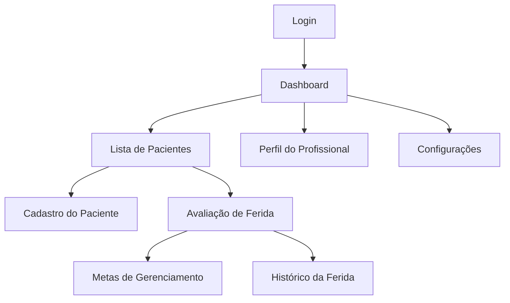

# 📱 Documento de Referência para o Time de UI/UX  
**Projeto:** Aplicativo *Cicatriza*  
**Versão:** 1.0  
**Base:** Formulário de Avaliação da Ferida  
**Objetivo:** Detalhar telas e componentes para criação do Design Visual e Prototipagem

---

## 🧭 Estrutura de Telas

1. **Tela de Login e Cadastro**
2. **Tela Inicial (Dashboard do Estomaterapeuta)**
3. **Tela de Lista de Pacientes**
4. **Tela de Cadastro do Paciente**
5. **Tela de Avaliação de Ferida**
6. **Tela de Histórico da Ferida**
7. **Tela de Plano de Tratamento e Reavaliação**
8. **Tela de Perfil do Profissional**
9. **Tela de Configurações e Sincronização**

---

## 🩺 1. Tela de Login e Cadastro

**Objetivo:**  
Permitir autenticação via Google/Microsoft e cadastro inicial do estomaterapeuta.

**Componentes:**
- Logo *Cicatriza*
- Botões de Login:  
  - “Entrar com Google”  
  - “Entrar com Microsoft”
- Link: “Criar nova conta”
- Ilustração: Profissional de saúde cuidando de paciente
- Rodapé: Versão do app e link de suporte

---

## 👩‍⚕️ 2. Tela Inicial (Dashboard do Estomaterapeuta)

**Objetivo:**  
Visão geral dos atendimentos e acessos rápidos.

**Componentes:**
- Header: Nome do usuário, foto e menu lateral
- Cards principais:
  - **Meus Pacientes**
  - **Próximas Avaliações**
  - **Relatórios**
- Botão flutuante ➕ “Novo Paciente”
- Seção “Últimas avaliações realizadas”

---

## 👥 3. Tela de Lista de Pacientes

**Objetivo:**  
Gerenciar pacientes cadastrados.

**Componentes:**
- Campo de busca
- Filtros (ativos, inativos, alta)
- Lista com:
  - Nome do paciente
  - Idade / Gênero
  - Última avaliação
  - Status (em tratamento / alta)
- Botão “Novo Paciente”

---

## 🧾 4. Tela de Cadastro do Paciente

**Campos:**
- Nome completo  
- Identificação (ID interno)  
- Idade  
- Peso (kg)  
- Gênero (Masculino / Feminino)  
- Estado nutricional (Boa / Ruim)  
- Mobilidade (Boa / Baixa)  
- Fumante (Sim / Não)  
  - Se sim: “Quantos por dia?”  
- Consumo de álcool (Unidades por semana)  
- Comorbidades  
- Medicações em uso  

**Ações:**
- Botão “Salvar Paciente”
- Botão “Cancelar”

---

## 🩹 5. Tela de Avaliação de Ferida

**Objetivo:**  
Registrar a avaliação completa da ferida.

**Seções:**

### 5.1 Informações da Ferida
- Tipo de ferida  
- Duração da ferida  
- Tratamentos anteriores  
- Localização anatômica (mapa corporal interativo)  
- Tamanho:  
  - Comprimento (mm)  
  - Largura (mm)  
  - Profundidade (mm)  
- Nível de dor (escala 0–10)

---

### 5.2 Avaliação do Leito da Ferida
**Campos:**
- % Granulação  
- % Epitelização  
- % Necrótico  
- % Esfacelo (Sloughy)
- Tipo de tecido (seleção)
- Exsudato (Baixo / Médio / Alto / Seco)
- Tipo de exsudato (Claro / Turvo / Purulento / Espesso)
- Infecção (Sim / Não)
- Sinais clínicos de biofilme (checkboxes):
  - Aumento da dor  
  - Eritema  
  - Calor local  
  - Odor fétido  
  - Atraso na cicatrização  

---

### 5.3 Avaliação da Borda da Ferida
**Campos:**
- Maceração  
- Desidratação  
- Deslocamento  
- Epíbole  
- Espessamento da borda  

---

### 5.4 Avaliação da Pele Perilesão
**Campos:**
- Maceração  
- Escoriação  
- Xerose  
- Hiperqueratose  
- Calo  
- Eczema  

---

### 5.5 Status e Evolução da Ferida
**Campos:**
- Primeira avaliação / Reavaliação  
- Status: Piora / Estagnada / Melhorando  
- Data da avaliação  
- Imagem da ferida (upload / câmera)  

---

## 🎯 6. Tela de Metas de Gerenciamento

**Objetivo:**  
Registrar objetivos de tratamento.

**Checkboxes de metas:**
- Remover tecido não viável  
- Gerenciar o exsudato  
- Controlar carga bacteriana  
- Reidratar o leito  
- Proteger granulação e epitelização  
- Reidratar a pele  
- Proteger a pele perilesional  

**Campos adicionais:**
- Escolha do tratamento / cobertura  
- Razão da escolha  
- Plano de reavaliação:  
  - Data da próxima visita  
  - Principal objetivo da próxima avaliação  

---

## 📈 7. Tela de Histórico e Relatórios

**Objetivo:**  
Visualizar evolução do paciente e exportar relatórios.

**Componentes:**
- Linha do tempo com registros de avaliações  
- Gráficos:  
  - Evolução da área da ferida (cm²)  
  - Escala de dor  
- Botões:
  - “Gerar PDF”  
  - “Compartilhar com outro estomaterapeuta”  

---

## 👤 8. Tela de Perfil do Profissional

**Campos:**
- Nome  
- Registro profissional (COREN)  
- Especialidade  
- Contato (telefone, e-mail)  
- Área de atuação  
- Foto de perfil  

**Ações:**
- Editar perfil  
- Exportar dados  

---

## ⚙️ 9. Tela de Configurações e Sincronização

**Componentes:**
- Sincronização com Google Drive / iCloud  
- Backup local  
- Tema (Claro / Escuro)  
- Política de privacidade e termos  
- Logout  

---

## 🎨 Diretrizes Visuais para o Time de UI/UX

**Design System sugerido:**
- Base: **Material Design 3**
- Paleta de cores:
  - Primária: `#009688` (verde clínico)
  - Secundária: `#4DB6AC`
  - Erro: `#E53935`
  - Background: `#FAFAFA`
- Tipografia:
  - Títulos: *Roboto Bold*
  - Texto: *Roboto Regular*
- Ícones: *Material Icons* / *Lucide*
- Layouts:
  - Mobile grid: 4 colunas  
  - Tablet grid: 8 colunas

---

## 📦 Navegação Geral

