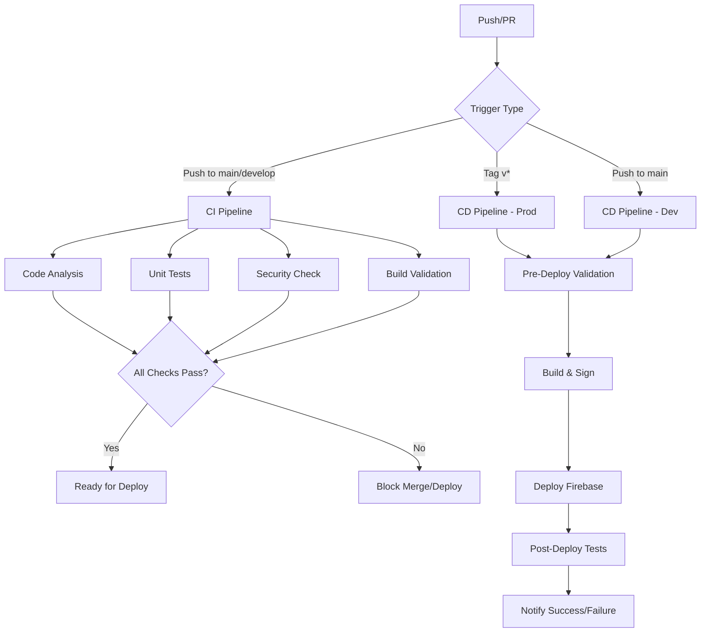

# CI/CD Pipeline - Cicatriza

## 🎯 Visão Geral

Este documento descreve a implementação completa do pipeline CI/CD para o projeto Cicatriza, seguindo as melhores práticas de DevOps, segurança e qualidade de código.

## 📋 Estrutura dos Pipelines

### 🔄 Continuous Integration (CI)
**Arquivo**: `.github/workflows/ci.yml`

**Triggers**:
- Push para branches: `main`, `develop`, `validacao_m0_m1`
- Pull Requests para: `main`, `develop`
- Execução manual (`workflow_dispatch`)

**Jobs Executados**:
1. **🔍 Code Analysis & Linting**
   - Verificação de formatação (`dart format`)
   - Análise estática (`flutter analyze`)
   - Verificação de dependências
   - Geração de relatório de análise

2. **🧪 Unit Tests**
   - Execução de todos os testes unitários
   - Geração de cobertura de código
   - Upload para Codecov
   - Relatório detalhado de testes

3. **🔐 Firebase Security Validation**
   - Validação de sintaxe das regras Firestore
   - Verificação de regras permissivas
   - Análise de configurações de segurança
   - Validação de autenticação obrigatória

4. **🏗️ Build Validation**
   - Build para ambientes `dev` e `prod`
   - APKs com ofuscação e símbolos de debug
   - Análise de tamanho do APK
   - Armazenamento de artefatos

5. **🔄 Integration Tests** (condicional)
   - Executado apenas em PRs de features
   - Testes de integração end-to-end
   - Validação de fluxos críticos

### 🚀 Continuous Deployment (CD)
**Arquivo**: `.github/workflows/cd.yml`

**Triggers**:
- Push para branch `main` (deploy dev)
- Tags `v*` (deploy prod)
- Execução manual com seleção de ambiente

**Jobs Executados**:
1. **🎯 Determine Environment**
   - Determina ambiente baseado no trigger
   - Configura variáveis de ambiente
   - Define se deve fazer deploy

2. **✅ Pre-Deploy Validation**
   - Execução de testes (opcional)
   - Validação de configuração Firebase
   - Verificações de segurança (prod)
   - Validação de regras Firestore

3. **🏗️ Build & Sign**
   - Setup de keystore (produção)
   - Build de APK release/debug
   - Assinatura digital (produção)
   - Métricas de build

4. **🚀 Deploy Firebase**
   - Deploy de regras Firestore
   - Deploy de regras Storage
   - Deploy de Functions (se existir)
   - Configuração por ambiente

5. **🧪 Post-Deploy Tests**
   - Testes de conectividade
   - Validação de regras aplicadas
   - Health check do projeto

6. **📢 Notify & Rollback**
   - Notificação de sucesso/falha
   - Sugestão de rollback (prod)
   - Resumo do deployment

### 📊 Performance Analysis
**Arquivo**: `.github/workflows/performance.yml`

**Triggers**:
- Pull Requests (análise de impacto)
- Execução manual
- Schedule semanal (segunda-feira 2h)

**Jobs Executados**:
1. **📊 Performance Analysis**
   - Análise de dependências
   - Análise de tamanho do build
   - Testes de performance
   - Métricas de código

2. **⚡ Benchmark Comparison**
   - Comparação com branch base
   - Métricas de tempo de build
   - Comparação de tamanho APK
   - Relatório de diferenças

3. **💡 Optimization Recommendations**
   - Recomendações baseadas na análise
   - Identificação de dependências pesadas
   - Sugestões de otimização
   - Dicas de performance

## 🏗️ Arquitetura do Pipeline

## 🔧 Configuração de Ambientes

### Development Environment
- **Branch**: `develop`, `main`
- **Firebase Project**: `cicatriza-dev`
- **Build Type**: Debug APK
- **Firestore Rules**: Relaxadas (`firestore.rules.dev`)
- **App Check**: Debug token
- **Analytics**: Desabilitado
- **Crashlytics**: Desabilitado

### Production Environment
- **Branch**: `main` (via tags)
- **Firebase Project**: `cicatriza-prod`
- **Build Type**: Release APK (assinado)
- **Firestore Rules**: Restritivas (`firestore.rules`)
- **App Check**: reCAPTCHA + Device/Play Integrity
- **Analytics**: Habilitado
- **Crashlytics**: Habilitado

## 🔐 Segurança e Validações

### Validações de Segurança Implementadas:
1. **Firestore Rules**:
   - Detecção de regras permissivas (`allow read, write: if true`)
   - Validação de autenticação obrigatória
   - Verificação de sintaxe das regras

2. **Configuração Firebase**:
   - Validação de configurações por ambiente
   - Verificação de App Check
   - Análise de tokens de debug em produção

3. **Build Security**:
   - Assinatura digital de APKs de produção
   - Ofuscação de código
   - Separação de símbolos de debug

4. **Branch Protection**:
   - PRs obrigatórios para branch `main`
   - Status checks obrigatórios
   - Revisão de código obrigatória

## 📊 Métricas e Monitoramento

### Métricas Coletadas:
- **Cobertura de Código**: Via LCOV e Codecov
- **Tamanho do APK**: Monitoramento de crescimento
- **Tempo de Build**: Benchmarks comparativos
- **Dependências**: Análise de peso e quantidade
- **Qualidade de Código**: Flutter analyze + lint rules

### Relatórios Gerados:
1. **CI Summary**: Status de todos os jobs
2. **Performance Report**: Métricas e recomendações
3. **Security Report**: Validações de segurança
4. **Build Metrics**: Tamanho, tempo, artefatos
5. **Coverage Report**: Cobertura detalhada por arquivo

## 🎯 Boas Práticas Implementadas

### DevOps:
- ✅ Pipeline as Code (YAML)
- ✅ Ambientes separados (dev/prod)
- ✅ Validação automática de qualidade
- ✅ Deploy automatizado
- ✅ Rollback strategy
- ✅ Artifact management
- ✅ Environment-specific configuration

### Segurança:
- ✅ Secret management (GitHub Secrets)
- ✅ Least privilege principle
- ✅ Code signing (produção)
- ✅ Security validation gates
- ✅ Firebase rules validation
- ✅ Dependency scanning

### Qualidade:
- ✅ Automated testing
- ✅ Code coverage tracking
- ✅ Static analysis
- ✅ Performance monitoring
- ✅ Linting and formatting
- ✅ Branch protection

## 🔄 Fluxo de Trabalho

### Desenvolvimento:
1. Criar feature branch a partir de `develop`
2. Implementar mudanças
3. Push trigger CI pipeline
4. Corrigir issues encontrados
5. Criar PR para `develop`
6. CI pipeline executa validações
7. Code review e aprovação
8. Merge para `develop`
9. Deploy automático para ambiente dev

### Produção:
1. Merge de `develop` para `main`
2. CI pipeline executa validações completas
3. Criar tag `v*` (ex: `v1.2.3`)
4. CD pipeline executa para produção
5. Validações de segurança rigorosas
6. Build e assinatura de APK
7. Deploy Firebase com aprovação
8. Testes pós-deploy
9. Notificação de sucesso/falha

## 🚨 Troubleshooting

### CI Pipeline Falha:
1. **Code Analysis**: Verificar linting e formatação
2. **Unit Tests**: Revisar testes quebrados
3. **Security**: Corrigir regras Firebase
4. **Build**: Verificar dependências e configuração

### CD Pipeline Falha:
1. **Pre-Deploy**: Verificar configuração Firebase
2. **Build**: Verificar keystore e assinatura
3. **Deploy**: Verificar permissões Firebase
4. **Post-Deploy**: Verificar conectividade

### Performance Issues:
1. Verificar tamanho do APK
2. Analisar dependências pesadas
3. Otimizar imagens e assets
4. Implementar lazy loading

## 🎯 Próximos Passos

1. **Implementar testes E2E** com Firebase Emulator
2. **Adicionar análise de vulnerabilidades** (Snyk/OWASP)
3. **Configurar notificações** (Slack/Teams)
4. **Implementar feature flags**
5. **Adicionar métricas de runtime**
6. **Configurar monitoring de produção**

## 📚 Recursos Adicionais

- [GitHub Actions Documentation](https://docs.github.com/en/actions)
- [Firebase CLI Reference](https://firebase.google.com/docs/cli)
- [Flutter CI/CD Best Practices](https://flutter.dev/docs/deployment/cd)
- [Android App Signing](https://developer.android.com/studio/publish/app-signing)
- [Codecov Integration](https://docs.codecov.com/docs)

---

**Última atualização**: Implementação completa do pipeline CI/CD com validações de segurança, ambientes separados e monitoramento de performance.