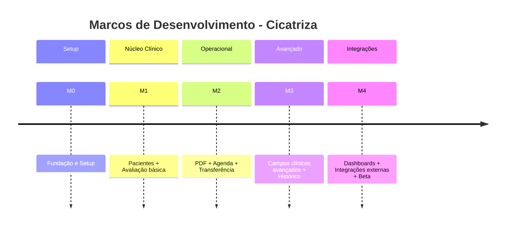

# 🧩 Marcos de Desenvolvimento — Projeto CICATRIZA

> Documento detalhado que define os marcos de entrega do aplicativo **Cicatriza** com base nos arquivos: Blueprint, DRN, Plano de Desenvolvimento, Modelo de Dados e Requisitos de Avaliação de Feridas.  
> Última atualização: 16/10/2025  

---

## **M0 — Fundação e Setup (Infraestrutura e Base do App)**

### 🎯 Objetivo
Estabelecer toda a base técnica e operacional da aplicação: arquitetura, ambiente Firebase, pipeline de CI/CD, autenticação e primeiros componentes do app Flutter.

### 📦 Escopo
- Configuração de repositórios (`cicatriza_app` + `cicatriza_functions`);
- Setup Firebase (Firestore, Storage, Auth, Functions, Hosting);
- Estrutura inicial Flutter (Clean Architecture + BLoC);
- Integração com provedores de login (Google e Microsoft);
- Regras de segurança v1 (Firestore + Storage);
- Configuração de ambientes (`dev`, `staging`, `prod`);
- Integração de CI/CD (GitHub Actions + Fastlane);
- Skeleton do app com tema (Material 3), navegação e injeção de dependências (GetIt).

### 📜 Entregas Técnicas
- `firebase.json`, `.firebaserc`, `firestore.rules`, `storage.rules`;
- Flutter base com rotas: Login, Home, Pacientes;
- `AuthRepository` e `UserProfileRepository` integrados ao Firestore;
- Emuladores locais funcionando (Auth, Firestore, Storage);
- Testes de integração iniciais (`flutter test` + coverage).

### ✅ Critérios de Aceitação
- Login e logout funcionando;
- Perfil do usuário criado automaticamente no Firestore;
- Build CI verde (lint, testes e cobertura ≥70%);
- Regras Firestore/Storage bloqueando acessos cruzados.

### ⚠️ Riscos
- Problemas de autenticação OAuth → Mitigação: fallback local e logs detalhados.
- Configurações erradas de rules → Mitigação: testes com emulador e validação manual.

### 📈 Indicadores
- 100% dos devs com ambiente configurado;
- Build pipeline automatizado;
- Autenticação funcional (Google/MS);
- Latência média do login < 3s.

---

## **M1 — Módulo Clínico Básico (Pacientes + Avaliação Inicial)**

### 🎯 Objetivo
Implementar o núcleo de cadastro de pacientes e avaliações iniciais de feridas, com suporte a fotos e funcionamento offline.

### 📦 Escopo
- CRUD completo de pacientes;
- Cadastro básico de feridas (tipo, localização, tempo de existência);
- Avaliação com campos essenciais: data, dor (0–10), medidas (C×L×P);
- Upload de fotos (câmera/galeria), compressão e thumbnails via Cloud Function;
- Cache local com Isar/Sqflite (offline-first);
- Sincronização Firestore ↔ local DB (fila transacional e retries).

### 📜 Entregas Técnicas
- `PatientRepository`, `WoundRepository`, `AssessmentRepository`;
- Components reativos de formulário;
- `MediaRepository` para upload e sync;
- Função `onStorageFinalize` (gera thumbnail e contador de imagens);
- Testes unitários (validação de dados clínicos);
- Protótipo funcional do fluxo: **Paciente → Ferida → Avaliação → Foto**.

### ✅ Critérios de Aceitação
- CRUD de pacientes e feridas operando online/offline;
- Upload e exibição de fotos com thumbnail;
- Dados persistidos localmente e sincronizados;
- Regras aplicadas: dor ≤ 10; dimensões > 0; data ≤ hoje.

### ⚠️ Riscos
- Upload lento → compressão + retry exponencial.
- Conflitos offline → resolver por timestamp (`last-write-wins`).

### 📈 Indicadores
- Tempo médio de cadastro < 2min;
- 100% das avaliações com dados válidos;
- Upload de foto < 5s (Wi-Fi).

---

## **M2 — Operacionalidade e Continuidade (PDF, Agenda e Transferência)**

### 🎯 Objetivo
Entregar funcionalidades operacionais para o uso diário do estomaterapeuta: relatórios em PDF, agendamento interno e transferência de pacientes entre profissionais.

### 📦 Escopo
- Geração de **PDF clínico** a partir das avaliações;
- Assinatura e logotipo do profissional no relatório;
- Agenda interna com lembretes locais e status de visitas;
- Transferência de paciente (convite/aceite);
- Auditoria de ações (log de transferências e exportações);
- Exportação de paciente (JSON + PDF).

### 📜 Entregas Técnicas
- Cloud Function `onAssessmentCreate` (triggers para gerar PDF);
- `PDFGeneratorService` local + fallback;
- `AppointmentRepository` com agendamentos e notificações locais;
- `TransferRepository` com ACLs e logs;
- Tela de Agenda + Tela de Transferência;
- LGPD: consentimento + exportar + excluir paciente.

### ✅ Critérios de Aceitação
- PDF gerado idêntico ao formulário original (formato A4);
- Agenda funcional com notificações locais;
- Transferência concluída entre usuários;
- Trilhas de auditoria completas (timestamp + userId + ação).

### ⚠️ Riscos
- PDF com erro em layout → fallback local.
- Notificações inconsistentes → teste de background e timeout.

### 📈 Indicadores
- PDF export < 10s;
- Notificação local em 100% das agendas criadas;
- 0 falhas em transferência entre contas.

---

## **M3 — Profundidade Clínica e Histórico**

### 🎯 Objetivo
Aprofundar o módulo clínico com todos os campos e regras de negócio definidas no DRN e no formulário original.

### 📦 Escopo
- Campos clínicos avançados:
  - **Leito**: percentuais (granulação, epitelização, necrose, esfacelo);
  - **Exsudato**: tipo, coloração, volume;
  - **Infecção**: odor, temperatura, eritema, biofilme;
  - **Borda**: maceração, epíbole, descolamento;
  - **Pele Perilesão**: integridade, edema, dermatite, descolamento;
- Cálculo automático: área (C×L), volume (C×L×P), % evolução;
- Histórico de avaliações com comparativo de fotos e gráficos.

### 📜 Entregas Técnicas
- Componentes: `FieldPercentQuadruple`, `ExudatePicker`, `InfectionChecklist`;
- Função `calculateEvolution()` integrada às avaliações;
- Gráficos de evolução (chart por paciente/ferida);
- Armazenamento histórico (timeline);
- Alertas de piora (condicional por indicadores).

### ✅ Critérios de Aceitação
- Campos clínicos funcionais e validados;
- Percentuais somando 100%;
- Gráficos de evolução renderizando corretamente;
- Histórico completo acessível e sincronizado.

### ⚠️ Riscos
- Complexidade de formulários → segmentação em abas e validações progressivas.
- Cálculos incorretos → testes automatizados para cada regra do DRN.

### 📈 Indicadores
- % avaliações com campos completos;
- Tempo médio de avaliação ≤ 5 min;
- Precisão do cálculo de área/volume (±1%).

---

## **M4 — Integrações, Dashboards e Otimização Final**

### 🎯 Objetivo
Expandir o valor analítico e integrativo do aplicativo, conectando-se a calendários externos e entregando painéis de indicadores.

### 📦 Escopo
- Integração Google Calendar e Microsoft Calendar (sincronização 1-way);
- Dashboards analíticos:
  - Nº pacientes ativos;
  - Nº avaliações/semana;
  - Tempo médio de cicatrização;
  - Status de feridas (ativas/cicatrizadas);
- Modo claro/escuro e internacionalização (pt-BR/en-US);
- Polimento de UI e performance.

### 📜 Entregas Técnicas
- Módulo de integração Calendar (API/Scopes OAuth);
- Painel Flutter com gráficos Recharts;
- Eventos Analytics configurados (Firebase);
- Refino de A11y, i18n e performance;
- Beta público (Firebase App Distribution).

### ✅ Critérios de Aceitação
- Sincronização de agenda externa testada;
- Dashboards renderizando KPIs em tempo real;
- Beta distribuído e feedback coletado;
- Crash-free users ≥ 98%.

### ⚠️ Riscos
- API Calendar falhar → feature flag + fallback local.
- KPIs inconsistentes → verificação manual com logs.

### 📈 Indicadores
- Sincronização de eventos 100% correta;
- Dashboards atualizados em < 3s;
- Crash-free users > 98%;
- AppStore/PlayStore pronto para submissão.

---

## **Resumo Visual dos Marcos**

